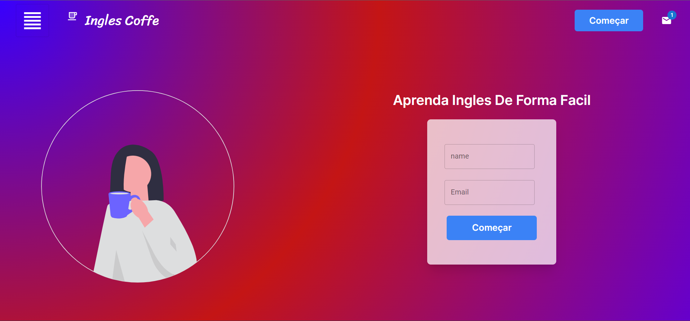
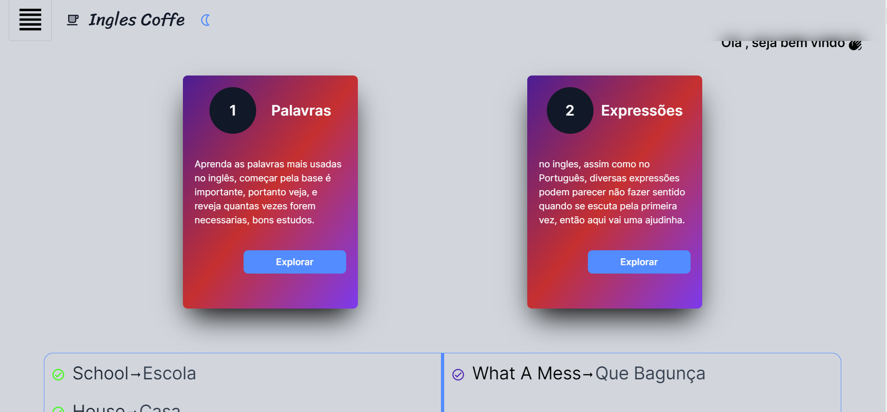
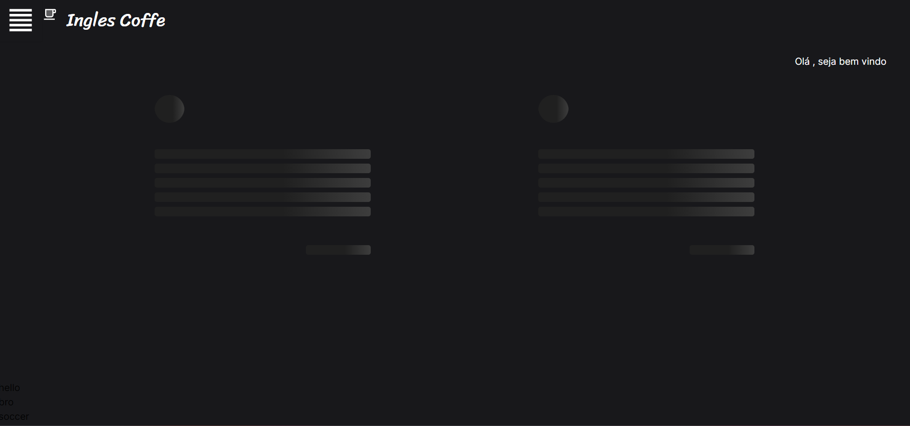
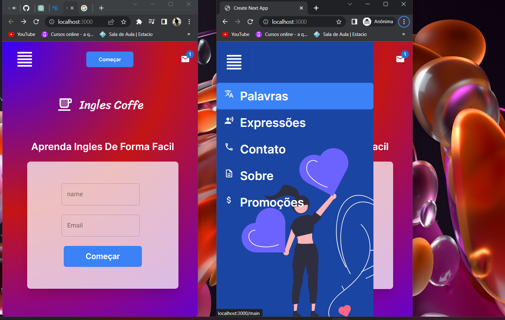

## aprenda inglés de forma facil e divertida 

First, run the development server:


```bash
git clone https://github.com/Deny-santos/ingles-coffe.git

# run the back-end
npm i
cd server
npm start

#run the front-end
npm run dev
# or
yarn dev
# or
pnpm dev
```

Open [http://localhost:3000](http://localhost:3000) with your browser to see the result.

You can start editing the page by modifying `app/page.tsx`. The page auto-updates as you edit the file.


<div align="center">
    <video width="640" height="480" controls>
    <source src="./public/vid-presentation.mp4" type="video/mp4">
    Seu navegador não suporta o elemento de vídeo.
  </video>
</div>
<div align="center">
    
</div>

<div align="center">
    
</div>

<div align="center">
    
</div>

<div align="center">
    
</div>